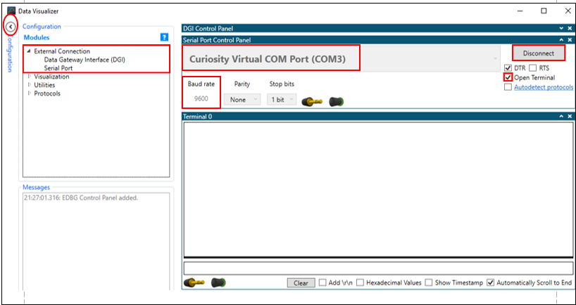

<!-- Please do not change this html logo with link -->

# 3-bit Ring Counter MPLABX example

## Introduction  
The Configurable Custom Logic (CCL) is a Core Independent Peripheral (CIP), which means it performs its tasks with no code or supervision from the CPU after configuration is completed. The CCL module is a programmable logic block and can be used to implement Combinational or Sequential logic functions. Since the logic functions implemented in the hardware have faster event response compared to the logic functions implemented in the software, the CCL gives the advantage of faster and predictable response to the users. This example demonstrates  3-bit ring counter implementation  using all 6 Look-Up-tables (LUTs) available with the CCL peripheral of AVR128DA48 MCU.

**Note:** ***This example could be generated with 48 and 64 pin AVR-DA devices.***

#### To see the 3bit ring counter demo operation video, click on the below image.

 

## Useful Links

- [AVR128DA48 Product Page](https://www.microchip.com/wwwproducts/en/AVR128DA28 "AVR128DA48 Product Page")
- [AVR128DA48 Code Examples on GitHub](https://github.com/microchip-pic-avr-examples?q=avr128da48 "AVR128DA48 Code Examples on GitHub")
- [AVR128DA48 Project Examples in START](https://start.atmel.com/#examples/AVR128DA48CuriosityNano "AVR128DA48 Project Examples in START")
- [3-bit Ring Counter - Studio Example]( https://github.com/microchip-pic-avr-examples/avr128da48-3bit-ring-counter-start-example.git "3-bit Ring Counter - Studio Example")

## Basics of Ring Counter: 
The ring counter is a type of counter composed of flipflops connected into a shift register, with the output of the last flipflop fed to the input of the first flipflop, making a circular or ring in structure. It is a synchronous counter which as a common clock signal that triggers all the flipflops at the same time. It is initialized such that only one of the flipflop output is 1 while the remainder is 0. Number of states of Ring counter is equal to number of flipflops used. To design three-bit ring counter, three flipflops are required. 

The sequence of output from the three-bit ring counter is: 

  
   Table 1: Output states of 3bit ring counter  

## Demo Description            

  
   Fig 1: Block diagram of three-bit Ring Counter  

In this example,
* The AVR128DA48 Curiosity Nano board from Microchip is used to realize the 3-bit Ring Counter.
* To realize 3-bit Ring Counter, 3 D flip-flops are required. A pair of LUTs is needed to realize one D flip-flop. All the 6 LUTs are used to realize 3 D flip-flops.
* LUT0 and LUT1 are configured together as D flip-flop 0, LUT2 and LUT3 are configured together as D flip-flop 1, and LUT4 and LUT5 are configured together as D flip-flop 2.
* These three D flip-flops are cascaded in such a way that output of D flip-flop 0 is fed to the input of D flip-flop 1, D flip-flop 1 output is fed to the D flip-flop 2 input and, D flip-flop 2 output is fed to the D flip-flop 0 input through Event system, to complete the required ring counter circuit as shown in below figure. 
 

  
   Fig 2:Cascaded connections of three D-flipflops  

 

* The even LUTs (i.e. LUT0/LUT2/LUT4) are configured to produce custom logic gate. The output of the Timer B, which is used as a clock signal is applied only to even LUTs. 
* All three inputs (i.e. Input (GPIO), Timer B (CLK), feedback of LUT4) is fed only to the first flipflop of LUT0 and value 0XEE is loaded in the truth table.
* A GPIO input connected to an even LUT0 is used to generate a Set pulse only to the first flipflop, and before the clock signal is applied, this allows feeding logic “1” value to the ring counter circuit. After reading the first flipflop output, GPIO is configured to feed a logic “0” value. 
* LUT2 and LUT4 are fed with only two inputs (i.e. Timer B (CLK), feedback input) and value 0XCC is loaded in the truth table.
* The odd LUTs (i.e. LUT1/LUT3/LUT5) are configured as OR gate and value 0X10 is loaded in the truth table.
* A GPIO connected to the odd LUTs is configured to generate a logic “1” signal to the LUTs, in order to pass the signals fed as an input to the even LUTs when the CLK signal is applied.
* For each clock signal, the data shift by one position among the three flipflops of ring counter circuit.
* The on-board mechanical switch (SW0) is used as a trigger for the Timer B to generate a single pulse, which is used as a clock signal to all the three flipflops.
* For each switch press event, data gets shifted from output of the D flip-flip 0 to the D flip-flop 1 input, D flip-flop 1 output to the D flip-flop 2 input and, D flip-flop 2 output to the D flip-flop 0 input.
* First state of the ring counter is displayed on the terminal window, without a switch press event, only once at the start of the functionality. Next time onwards, a switch press event is required to display the first state of the ring counter.
* The on-board indication LED blinks, whenever a switch (SW0) press event is reported. 
* The 3-bit ring counter data gets transferred to the terminal window of  data visualizer tool through mEDBG of the AVR128DA48 Curiosity Nano board.

## Hardware used

* AVR128DA48 Curiosity Nano Evaluation Kit [[Part Number:DM164151]](https://www.microchip.com/DevelopmentTools/ProductDetails/PartNO/DM164151 "[Part Number:DM164151]")

  
   Fig 3 : AVR128DA48 Curiosity Nano Evaluation Kit 

 

## Software used

- [MPLAB X IDE v5.40](https://www.microchip.com/mplab/mplab-x-ide "MPLAB X IDE v5.40")
- [XC8 Compiler v2.20](https://www.microchip.com/mplab/compilers "XC8 Compiler v2.20")
- [MPLAB Code Configurator (MCC) v3.95.0](https://www.microchip.com/mplab/mplab-code-configurator "MPLAB Code Configurator (MCC) v3.95.0")
- [AVR8bit Lib v2.3.0](https://www.microchip.com/mplab/mplab-code-configurator "AVR8bit Lib v2.3.0")
- [AVR-Dx DFP 1.3.65](https://packs.download.microchip.com/  "AVR-Dx DFP 1.3.65")
- [Standalone Data Visualizer v2.20.674](https://www.microchip.com/mplab/avr-support/data-visualizer "Standalone Data Visualizer v2.20.674")

**Note: For running the demo, the installed tool versions should be the same or later. This example is not tested with the previous versions.**

## Steps to open Terminal window in Data Visualizer:

Open the Terminal window in Standalone Data Visualizer tool to observe the data of the ring counter and follow the below mentioned steps to open terminal window.

1.	In the Data Visualizer window, click on the **Configuration tab**.
2.	In the **Modules section**, expand **External connection** option and then double click on Serial Port.
3.	Select the **Curiosity Virtual Com Port** in Serial Port Control Panel.
4.	Set the Baud rate to 9600.
5.	Check the **“Open Terminal”** option.
6.	Click on the **Connect** button and then terminal window is opened.

  
   <strong>Fig 4 : Standalone Data Visualizer window 

## Demo Operation:

* After the Curiosity Nano board is powered on, load the firmware to AVR128DA48 MCU as explained in the Device Programming section.
* Before each switch press, read the instructions provided on the terminal window. E.g. Press switch- To display first state of the Ring Counter.
* Observe first state of the ring counter is displayed by default on the terminal window, only once at the start of the functionality, without a switch press event. The text displayed on the terminal window is “First state=1 0 0”.

  
   Fig 5 : Initial status on Terminal window 

* After the first state is displayed on terminal window, user needs to wait for the next instruction to be displayed on terminal window. 
* Press Switch (SW0) to display the second state of the ring counter and observe the text “Second state = 0 1 0” is displayed on terminal window.
* Observe the next instruction to the user is displayed on terminal window.

  
   Fig 6 : Second state on Terminal window 

* Press Switch (SW0) to display the third state of the ring counter and observe the text “Third state = 0 0 1” is displayed on terminal window.
* Observe again the first instruction to the user is displayed on terminal window.
* Press Switch (SW0) to display the first state of the ring counter on the terminal window.

  
   Fig 7 : Third state on Terminal window 

## Conclusion:
This example demonstrates configuration and usage of CIP’s (Core Independent Peripherals), such as CCL and Event System in the application. This example also explains realization of 3-bit Ring Counter using all the 6 LUTs  of CCL peripheral available on the AVR128DA48 MCU. 

The usage of CCL peripheral provides predictable response time, reduces firmware complexity and offers component integrity by allowing sequential logic gates realization without the need for on-board Programmable Logic Devices (PLDs). Thereby reducing BOM cost and speed up time to market for the new products. 

## Appendix:  MCC Project creation

This section explains how to generate firmware using MCC.
#### 1. Create a New MPLAB X Project and Open MCC
- Open the MPLAB X IDE
- Create New project: File -> New Project
- Select Microchip Embedded -> Standalone Project
- Select AVR128DA48 as the target device
- Select XC8 as compiler
- Open MCC by clicking the MCC icon in the toolbar 

#### 2. Configure MCC
##### o	Add Peripherals to project
- Add CCL, Event system, Timer/Counter type B (TCB), USART1 to the project.

  
   Fig 8: Add peripherals to the project 

## System module configuration:
The system configuration window of MCC is used for MCU oscillator, Brown-out Detector, Watchdog timer and low voltage programming configuration. The **Internal Oscillator** option is selected as a clock source and by default 4 MHz system clock is selected as a Oscillator frequency. Check the **Prescaler Enable** option and select prescaler division as 4x which generates **1MHz** frequency as the main clock.

  
   Fig 9: System module configuration window 

## USART1 configuration: 
In this example, USART1 is used to transmit the data on the terminal window, to display the three states of the ring counter (i.e. First state=100/Second state=010/Third state=001). The USART1 peripheral is also used to transmit the instructions to the user on terminal window. Configurations to be done on USART1 peripheral.
* Check the **Printf support** checkbox.
* Set the **Baud Rate** to **9600**.
* Check the **Enable USART Transmitter** checkbox.

  
   Fig 10: USART1 configuration window 

## Timer B configuration: 
Timer B is a 16-bit Timer which is configured in a Single Shot Mode and it generates a Single pulse which is used as a Clock signal for all the three D-flipflops. The output of all the three D-flipflops changes with respective to this clock signal.  Configurations to be done on TCB2 peripheral.
* Check the **Enable TCB** option to enable the TCB2 module.
* Select **CLK_PER/2** option from the drop-down menu against the **Clock Select** field.
* Select the **Single Shot** mode option from the drop-down menu against the **Timer Mode**.
* Set the **Timer Period** value to **510us**.
* Check the **Enable Event Input Capture** field.
* Check the **Enable Pin Output** field. This will enable the Timer waveform output on the corresponding pin.

  
   Fig 11: Timer configuration window 

## Configurable Custom Logic(CCL) configuration: 
To realize this example 3 D-flipflops are required. In CCL, LUT0 and LUT1 are configured together as a D-flipflop 0, LUT2 and LUT3 are configured together as a D-flipflop 1, LUT4 and LUT5 are configured together as a D-flipflop 2.

 ### Configurations to be done for LUT0.
* Check the **Enable CCL** option, which enables the CCL peripheral.
* Select the **LUT0** in CCL settings window and scroll down the cursor.

  
   Fig 12: LUT0 and LUT1 block diagram 

* Check the **Enable LUT** option, which enables the LUT0.
* Select the **EVENT B** option from the dropdown menu against the **LUT-IN0** field. The output of the D-flipflop 2 (LUT 4) is given as input to the D-flipflop 0 through Event System, which is named as    EVENT B.
* Select the **IN1** option from the drop-down menu against the **LUT-IN1** field. IO input is fed only to the first flipflop. IO PA1 pin is configured as an output, which will feed logic “1” signal to the first flipflop.
* Select **EVENT A** option from the drop-down menu against the **LUT-IN2** field. The Single pulse generated by Timer B, which is used as a clock signal is fed to the LUT0 through Event System, which is named as EVENT A.
* Check the **Enable LUT-OUT** field, which enables the output of LUT0 on the corresponding pin.
* In Truth Table section, select the gate as **Custom** and configure the output value to **0XEE**.
* In **Sequential Configuration** section, select the **DFF**(D-flipflop) option from the drop-down menu against the **Sequential Logic** field. 

  
   Fig 13: LUT0 configuration window 

### Configurations to be done for LUT1.
* Check the **Enable LUT** option, which enables LUT1.
* Select the **IN2** option from the drop-down menu against the **LUT-IN2** field. PC2 pin is configured as an input and pull-up option is enabled which feeds a logic “1” signal to the LUT1.
* In Truth Table section, select OR gate option from the drop-down menu.

  
   Fig 14: LUT1 configuration window  

### Configurations to be done for LUT2.
* Check the **Enable CCL** option, which enables the CCL peripheral.
* Select the **LUT2** in CCL settings window and scroll down the cursor.

  
   Fig 15: LUT2 and LUT3 block diagram  

* Check the **Enable LUT** option, which enables the LUT2.
* Select the **EVENT B** option from the dropdown menu against the **LUT-IN1 field**. The output of the D-flipflop 0 is given as input to the D-flipflop 1 through Event System, which is named as EVENT B.
* Select **EVENT A** option from the drop-down menu against the **LUT-IN2** field. The Single pulse generated by Timer B, which is used as a clock signal is fed to the LUT2 through Event System, which is named as EVENT A.
* Check the **Enable LUT-OUT** field, which enables the output of LUT2 on the corresponding pin.
* In Truth Table section, select the gate as **Custom** and configure the output value to **0XCC**.
* In **Sequential Configuration** section, select the **DFF** (D-flipflop) option from the drop-down menu against the **Sequential Logic** field. 

  
   Fig 16: LUT2 configuration window  

### Configurations to be done for LUT3
* Check the **Enable LUT** option, which enables LUT3.
* Select the **IN2** option from the drop-down menu against the **LUT-IN2** field. PF2 pin is configured as an input and pull-up option is enabled which feeds a logic “1” signal to the LUT3.
* In Truth Table section, select OR gate option from the drop-down menu.

  
   Fig 17: LUT3 configuration window  

### Configurations to be done for LUT4.
* Check the **Enable CCL** option, which enables the CCL peripheral.
* Select the **LUT4** in CCL settings window and scroll down the cursor.

  
   Fig 18: LUT4 and LUT5 block diagram  

* Check the **Enable LUT** option, which enables the LUT4.
* Select the **EVENT B** option from the dropdown menu against the **LUT-IN1** field. The output of the D-flipflop 1 is given as input to the D-flipflop 2 through Event System, which is named as EVENT B.
* Select **EVENT A** option from the drop-down menu against the **LUT-IN2 field**. The Single pulse generated by Timer B, which is used as a clock signal is fed to the LUT4 through Event System, which is named as EVENT A.
* Check the **Enable LUT-OUT** field, which enables the output of LUT4 on the corresponding pin.
* In Truth Table section, select the gate as **Custom** and configure the output value to **0XCC**.
* In **Sequential Configuration** section, select the **DFF** (D-flipflop) option from the drop-down menu against the **Sequential Logic** field. 

  
   Fig 19: LUT4 configuration window  

### Configurations to be done for LUT5.
* Check the **Enable LUT** option, which enables LUT5.
* Select the **EVENTA** option from the drop-down menu against the **LUT-IN2** field. PA2 pin is configured as an input and pull-up option is enabled, which feeds a logic “1” signal to the LUT5 through Event system, which is named as EVENTA.
* In Truth Table section, select OR gate option from the drop-down menu.

  
   Fig 20: LUT5 configuration window  

**Note:** Once all the peripherals configuration is done and MCC files are generated, open ccl.c file from src (source) folder in the project. In the file write a value “0XF3” to the registers named as CCL.LUT0CTRLA, CCL.LUT2CTRLA and CCL.LUT4CTRLA. Writing this value to a register allows to use TCB2 (Timer B) output as a clock to even LUT’s. 

## Event System: 
In this example, event system is used to connect the output of D-flipflop 0 to the input of D-flipflop 1 and output of D-flipflop 1 to the input of D-flipflop 2 and output of D-flipflop 2 to the input of D-flipflop 0.
Event system is also used to connect output of the Timer B (generates a single pulse, which is used as a clock signal) to LUT0, LUT2, LUT4. Configurations to be done for the event system.
* Select **PORTA_PIN2** option from the drop-down menu against the Event Generator, which is connected to the Event User **CCLLUT5A** through CHANNEL 0.
* Select **PORTC_PIN7** option from the drop-down menu against the Event Generator, which is connected to the Event User **TCB2CAPT** through CHANNEL 2.
* Select **TCB2_CAPT** option from the drop-down menu against the Event Generator, which is connected to the Event User **CCLLUT0A, CCLLUT2A** and **CCLLUT4A** through CHANNEL 3.
* Select **CCL_LUT0** option from the drop-down menu against the Event Generator, which is connected to the Event User **CCLLUT2B** through CHANNEL 4.
* Select **CCL_LUT2** option from the drop-down menu against the Event Generator, which is connected to the Event User **CCLLUT4B** through CHANNEL 5.
* Select **CCL_LUT4** option from the drop-down menu against the Event Generator, which is connected to the Event User **CCLLUT0B** through CHANNEL 6.

  
   Fig 21: Event system configuration window 1  

  
    Fig 22: Event system configuration window 2  

## Pin Module: 
The I/O pin mapping of the AVR128DA48MCU for USART3, CCL, Timer B interface, Curiosity Nano on-board LED and switch is shown in below figure. This configuration needs to be done in Pin Module section of the MCC.
* Configure pin PA1 as output, which feeds logic “1” signal to LUT0.
* Select pin PA2 as input and enable PULLUPEN, which feed logic “1” signal to LUT5.
* Configure pin **PA3** as output of LUT0.
* Configure pin **PB3** as output of LUT4.
* Configure pin **PB4** as TCB2 output waveform. 
* Configure pin **PC0** as USART1 TXD pin.
* Configure pin **PC7** as output.  The PC7 pin is connected to Switch and select **“Sense Rising Edge”** interrupt, which is used for detecting the switch press event.
* Configure pin **PD3** as output of LUT2.
* Configure pin **PC6** as output, to control on-board LED.
* Configure pin **PC2** as input and enable **PULLUPEN**, which feed logic “1” signal to LUT1.
* Configure pin **PF2** as input and enable **PULLUPEN**, which feed logic “1” signal to LUT3.

  
   Fig 23: Pin module configuration window  

	

